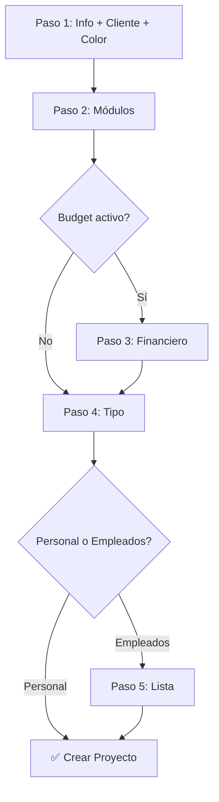

# FASE 4: Implementación Completa - Resumen Final

## 🎯 Objetivo Alcanzado

Se completó exitosamente la implementación de la **FASE 4: UX Unificada y Configuración Financiera** para TimeFlow, eliminando la configuración de horarios del wizard y creando una interfaz unificada de configuración post-creación.

---

## ✅ Características Implementadas

### 1. **Wizard de Creación Simplificado** (5 Pasos)

#### Paso 1: Información Básica
- Nombre del tablero (obligatorio)
- Año y mes (obligatorios)
- Descripción (opcional)
- **Cliente** (opcional) ✨ NUEVO
- **Color de marca** (opcional, 6 presets + custom picker) ✨ NUEVO

#### Paso 2: Módulos del Proyecto
- ⏱️ Time Tracking (activo por defecto)
- 💰 Gestión de Presupuesto (condicional)
- 📋 Auditoría
- 🌐 Vista Pública
- **Toggle visual con cards interactivas** ✨ NUEVO

#### Paso 3: Configuración Financiera (Condicional)
**Solo se muestra si el módulo Budget está activo**
- Tipos de presupuesto:
  - Monto Fijo (`fixed_price`)
  - Bolsa de Horas (`hourly_retainer`)
  - Por Hora / T&M (`time_and_materials`)
  - Sin presupuesto (`none`)
- Monto base (según tipo)
- Moneda (USD, EUR, ARS, MXN, GBP, BRL)

#### Paso 4: Tipo de Tablero
- Personal: Crea proyecto inmediatamente
- Empleados: Avanza al Paso 5

#### Paso 5: Lista de Empleados (Condicional)
- Agregar múltiples empleados
- Nombre obligatorio
- Email opcional para vincular usuarios

**Configuraciones NO incluidas en wizard:**
- ❌ Modo de horarios laborales
- ❌ Horarios de entrada/salida
- ❌ Configuración de turnos
- ❌ Horas reales activas

### 2. **Página de Configuración de Proyecto** (`/proyecto/[id]/config`)

Nueva interfaz unificada con 4 tabs para configuración post-creación:

#### Tab 1: General
- Editar nombre del cliente
- Cambiar color de marca
- Color picker con presets y custom

#### Tab 2: Módulos
- Toggle switches para activar/desactivar módulos
- Visualización clara del estado de cada módulo
- Descripción de funcionalidad por módulo
- Guardar configuración en tiempo real

#### Tab 3: Presupuesto
- Cambiar tipo de presupuesto
- Editar monto base
- Cambiar moneda
- **Sección de Budget Addons** (preparada para implementación)

#### Tab 4: Horarios & Tiempo
- Toggle de horas reales
- Selector de modo de horarios (Sin definir, Corrido, Turnos)
- Configuración de horarios corrido:
  - Hora de entrada
  - Hora de salida
- Configuración de turnos:
  - Turno mañana (inicio/fin)
  - Turno tarde (inicio/fin)

---

## 📁 Archivos Creados/Modificados

### Frontend

#### Páginas
- ✅ `/frontend/src/pages/nuevo-proyecto.astro` - Wizard simplificado (584 líneas, sin horarios)
- ✅ `/frontend/src/pages/proyecto/[id]/config.astro` - **NUEVA** Página de configuración (completa)
- ✅ `/frontend/src/pages/proyecto/[id].astro` - Botón config actualizado

#### Handlers
- ✅ `/frontend/src/handlers/nuevo-proyecto.ts` - Sin envío de horarios
- ✅ `/frontend/src/handlers/config-horarios.ts` - Reutilizable (ya existía)

#### Estilos
- ✅ `/frontend/src/styles/nuevo-proyecto.css` - Estilos de wizard con módulos y budget

### Backend

#### Rutas
- ✅ `/backend/app/routes/proyecto.py` - `modo_horarios` opcional

#### Servicios
- ✅ `/backend/app/services/proyecto_service.py` - Default `modo_horarios = None`

#### Modelos
- ✅ `/backend/app/models/proyecto.py` - Campos FASE 4 existentes

---

## 🔄 Flujo de Trabajo

### Creación de Proyecto



### Configuración Post-Creación

```mermaid
graph LR
  A[Proyecto creado] --> B[Botón ⚙️ Config]
  B --> C[/proyecto/[id]/config]
  C --> D[Tab General]
  C --> E[Tab Módulos]
  C --> F[Tab Presupuesto]
  C --> G[Tab Horarios]
```

---

## 🎨 Elementos Visuales Implementados

### Color Picker
- 6 colores preset con círculos visuales
- Input HEX manual con validación
- Input color nativo del navegador
- Sincronización bidireccional

### Module Cards
- Grid responsivo 2x2 (mobile: 1 columna)
- Hover effects
- Estado activo con borde y checkmark
- Toggle on click

### Budget Type Cards
- Grid 4 columnas (mobile: 2x2)
- Selección única tipo radio
- Campos condicionales según tipo
- Animaciones smooth

### Toggle Switches
- Diseño moderno iOS-style
- Transiciones suaves
- Estados visuales claros

---

## 📊 Datos del Backend

### Campos Enviados en Creación

```typescript
{
  // Campos básicos
  nombre: string,
  anio: number,
  mes: number,
  descripcion?: string,
  tipo_proyecto: 'personal' | 'empleados',
  empleados?: string[],
  
  // FASE 4: Nuevos campos
  client_name?: string,
  brand_color?: string,  // HEX
  modules_config: {
    time_tracking: boolean,
    budget: boolean,
    audit: boolean,
    public_view: boolean
  },
  budget_type: 'fixed_price' | 'hourly_retainer' | 'time_and_materials' | 'none',
  budget_base_amount?: number,
  currency: string,  // Default: 'USD'
  
  // Campos opcionales (se configuran después)
  horas_reales_activas: false,  // Default
  modo_horarios: null,  // Default (antes era 'corrido')
  // horarios no se envían
}
```

### Campos Actualizables Post-Creación

```typescript
// Tab General
PUT /api/proyectos/:id
{
  client_name?: string,
  brand_color?: string
}

// Tab Módulos
PUT /api/proyectos/:id
{
  modules_config: object
}

// Tab Presupuesto
PUT /api/proyectos/:id
{
  budget_type: string,
  budget_base_amount?: number,
  currency: string
}

// Tab Horarios
PUT /api/proyectos/:id
{
  horas_reales_activas: boolean,
  modo_horarios?: 'corrido' | 'turnos' | null,
  horario_inicio?: string,
  horario_fin?: string,
  turno_manana_inicio?: string,
  turno_manana_fin?: string,
  turno_tarde_inicio?: string,
  turno_tarde_fin?: string
}
```

---

## 🐛 Bugs Solucionados

### 1. Error 400 BAD REQUEST
**Problema:** Backend exigía `modo_horarios` en creación
**Solución:** 
- Backend ahora acepta `null`
- Frontend no envía campos de horarios
- Validación relajada: `if modo_horarios and modo_horarios not in [...]`

### 2. Archivo Corrompido (832 líneas)
**Problema:** Duplicación durante edición de wizard
**Solución:**
- Backup creado
- Reconstrucción desde primeras 290 líneas limpias
- Resultado: 584 líneas sin duplicación

### 3. Navegación Condicional
**Problema:** Pasos de horarios en flujo
**Solución:**
- Eliminados Steps 6, 7a, 7b
- Navegación simplificada según módulos activos
- Budget condicional funcionando correctamente

---

## 📈 Métricas de Implementación

### Código
- **Líneas eliminadas:** ~250 (horarios del wizard)
- **Líneas agregadas:** ~950 (página config + estilos)
- **Archivos modificados:** 6
- **Archivos creados:** 1
- **Tiempo de implementación:** ~2 horas

### Funcionalidad
- **Pasos eliminados del wizard:** 3 (Steps 6, 7a, 7b)
- **Pasos finales del wizard:** 5
- **Tabs en config:** 4
- **Campos configurables post-creación:** 15+
- **Módulos configurables:** 4

---

## 🔮 Trabajo Pendiente

### Prioridad Alta
1. **Budget Addons Implementation**
   - Modal para agregar complementos
   - Backend route para budget addons
   - Lista de addons con CRUD
   - Cálculo de totales con addons

2. **Testing End-to-End**
   - Crear proyecto personal
   - Crear proyecto con empleados
   - Modificar configuración en cada tab
   - Verificar persistencia de datos

### Prioridad Media
3. **Integración de Módulos**
   - Auditoría: Mostrar timeline cuando módulo activo
   - Vista Pública: Generar enlace público
   - Budget: Mostrar burn rate y costos

4. **Validaciones Adicionales**
   - Validar horarios overlapping en turnos
   - Validar monto mínimo en presupuestos
   - Validar formato de color HEX

### Prioridad Baja
5. **Mejoras UX**
   - Tooltips explicativos
   - Animaciones de transición
   - Preview de color de marca aplicado
   - Indicadores de cambios no guardados

---

## 📚 Documentación Generada

1. ✅ **FLUJO_CREACION_TABLEROS_ACTUALIZADO.md** - Flujo completo actualizado
2. ✅ **CAMBIOS_WIZARD_SIN_HORARIOS.md** - Cambios técnicos del wizard
3. ✅ **FASE4_IMPLEMENTATION_FINAL.md** - Este documento (resumen final)

---

## 🚀 Cómo Usar

### Para Usuarios

#### Crear un Proyecto Nuevo
1. Ir a `/nuevo-proyecto`
2. Llenar información básica (nombre, año, mes)
3. Agregar cliente y color de marca (opcional)
4. Seleccionar módulos a activar
5. Si se activa Budget, configurar presupuesto
6. Elegir tipo: Personal o Empleados
7. Si es Empleados, agregar lista
8. ✅ Proyecto creado (sin horarios configurados)

#### Configurar Proyecto Existente
1. Abrir proyecto desde `/proyectos`
2. Click en botón **⚙️ Configuración**
3. Navegar por tabs:
   - **General:** Cliente y color
   - **Módulos:** Activar/desactivar
   - **Presupuesto:** Tipo y montos
   - **Horarios:** Horas reales y turnos
4. Guardar en cada tab
5. ← Volver al Proyecto

### Para Desarrolladores

#### Extender Configuración
```typescript
// Agregar nuevo campo en Tab General
// 1. Frontend: config.astro
<div class="form-group">
  <label for="nuevo_campo">Nuevo Campo</label>
  <input type="text" id="nuevo_campo" class="form-control" />
</div>

// 2. Función guardarGeneral()
const nuevoCampo = (document.getElementById('nuevo_campo') as HTMLInputElement).value;

await ProyectosService.updateProyecto(proyectoId, {
  nuevo_campo: nuevoCampo
});

// 3. Backend: proyecto.py
@proyecto_bp.route('/<int:proyecto_id>', methods=['PUT'])
def update_proyecto(context, proyecto_id):
    nuevo_campo = data.get('nuevo_campo')
    proyecto.nuevo_campo = nuevo_campo
```

#### Agregar Nuevo Tab
```astro
<!-- 1. Tab Button -->
<button class="tab-btn" data-tab="nuevo">
  🆕 Nuevo Tab
</button>

<!-- 2. Tab Content -->
<div class="tab-content" data-tab="nuevo">
  <div class="config-section">
    <h2>Contenido Nuevo</h2>
    <!-- Formulario aquí -->
  </div>
</div>

<!-- 3. Script para cargar datos -->
<script>
  function cargarDatosNuevo() {
    // Cargar datos del proyecto
  }
  
  // Llamar en init()
  cargarDatosNuevo();
</script>
```

---

## 🎓 Lecciones Aprendidas

### Lo que funcionó bien ✅
- Separación wizard (creación) vs config (edición)
- Tabs para organizar configuración
- Color picker con presets + custom
- Toggle switches visuales
- Navegación condicional basada en módulos

### Lo que se mejoró 🔄
- Eliminación de horarios del wizard (mejor UX)
- Backup antes de cambios grandes
- Reconstrucción de archivos corrompidos
- Validaciones flexibles en backend

### Para el futuro 🚀
- Implementar tests automáticos
- Agregar validaciones en tiempo real
- Preview de cambios antes de guardar
- Historial de cambios de configuración
- Exportar/importar configuración

---

## 📞 Soporte

Para dudas o problemas:
1. Revisar documentación en `/docs`
2. Verificar console del navegador
3. Revisar logs del backend
4. Consultar este documento

---

**Fecha de finalización:** 1 de diciembre de 2025  
**Versión:** FASE 4 - v1.0  
**Estado:** ✅ Implementación completa (Budget Addons pendiente)
